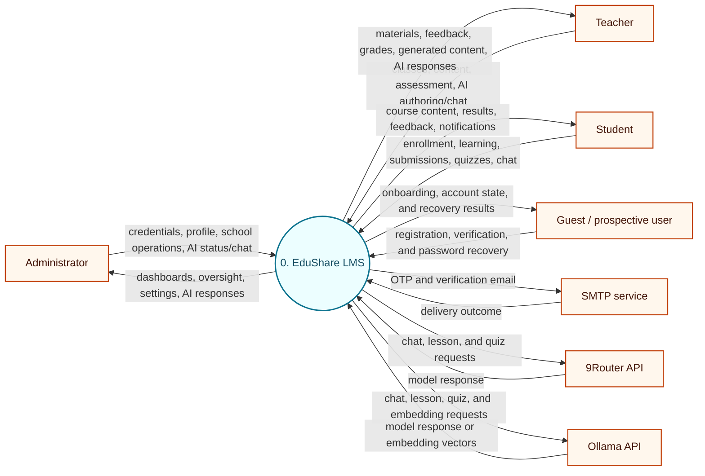
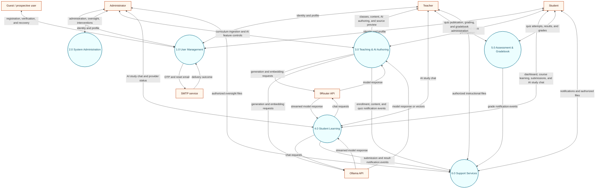
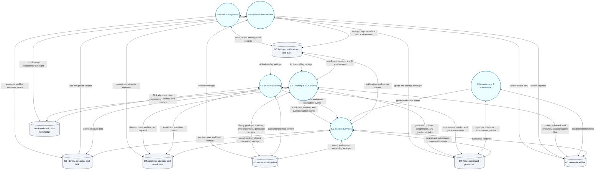
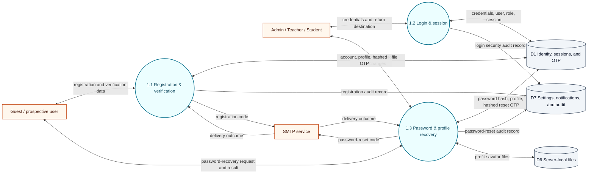
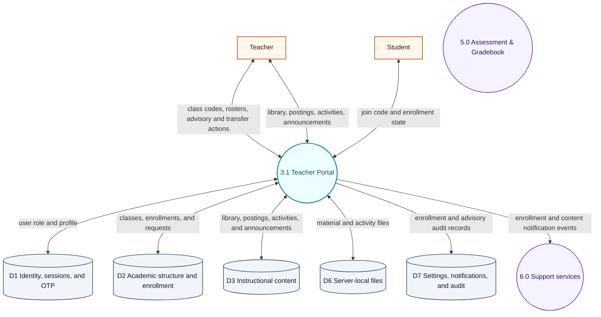
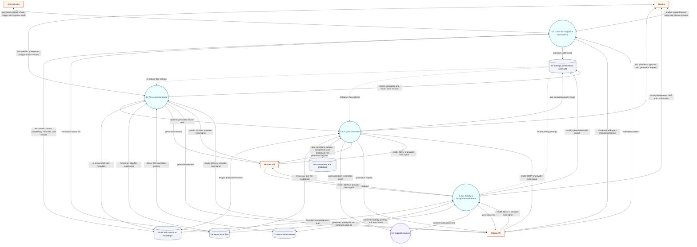
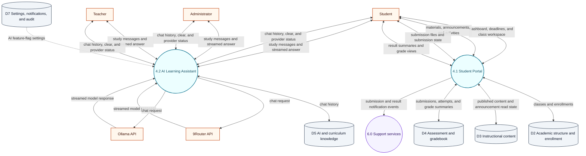
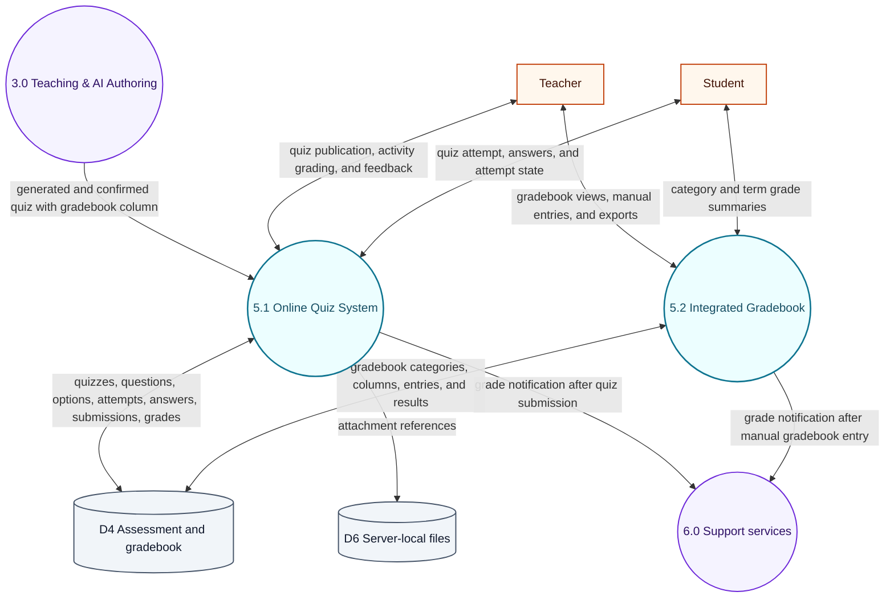
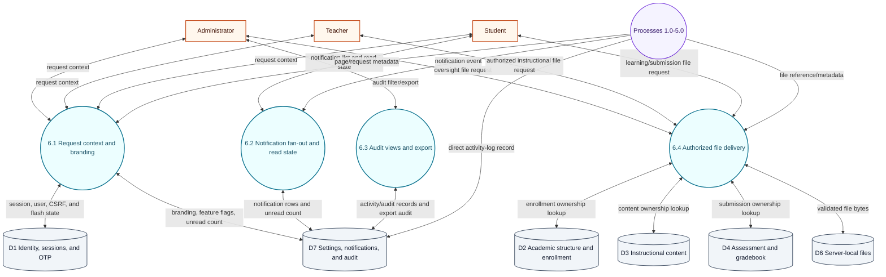

# EduShare 2.0 Data Flow Diagrams

## Document purpose

This document describes the **implemented** data flows of EduShare 2.0. It provides:

1. a Context DFD for the complete LMS;
2. a Level 0 DFD for the six top-level processes and the seven logical data stores; and
3. focused Level 1 DFDs for user management, system administration, teaching and AI authoring, student learning, assessment and gradebook, and cross-cutting support services.

The diagrams are derived from the current source tree rather than from older product descriptions. In particular, grounded lesson and quiz generation uses the teacher's lesson plan as its content source; curriculum retrieval is a separate source-preview capability (3.5) and is not injected into those generation prompts.

## Scope and notation

### System boundary

The EduShare system boundary includes:

- the Express request/response application;
- server-rendered EJS pages and JSON endpoints;
- authentication, authorization, validation, and business services;
- the MySQL database reached through `src/config/database.js`;
- the MySQL-backed session store;
- server-local files under `storage/uploads`; and
- AI provider selection, fallback, and curriculum embedding/retrieval logic.

The following are outside the boundary and therefore are not expanded into processes:

- browsers and operating systems;
- Express, Node.js, MySQL, and the local filesystem as infrastructure internals;
- network transport; and
- version control and deployment tooling.

The ten modules of the official EduShare module list are grouped into **six** top-level processes at Level 0, and each module maps to exactly one process as shown below.

| # | Official module | Level 0 process |
|---|---|---|
| 1 | User Management | **1.0 User Management** |
| 2 | System Administration | **2.0 System Administration** |
| 3 | Teacher Portal | **3.0 Teaching & AI Authoring** |
| 4 | AI Lesson Generator | **3.0 Teaching & AI Authoring** |
| 5 | AI Quiz Generator | **3.0 Teaching & AI Authoring** |
| 6 | AI Activity & Assignment Generator | **3.0 Teaching & AI Authoring** |
| 7 | Student Portal Module | **4.0 Student Learning** |
| 8 | Online Quiz System | **5.0 Assessment & Gradebook** |
| 9 | AI Learning Assistant | **4.0 Student Learning** |
| 10 | Integrated Gradebook | **5.0 Assessment & Gradebook** |
| — | Cross-cutting platform capabilities: notifications, file delivery, search, branding, audit | **6.0 Support Services** |

The grouping is functional rather than one-process-per-module: modules 3–6 are all teacher-facing authoring features reached from the Teacher Portal, modules 7 and 9 are both student-facing learning experiences, and modules 8 and 10 are both assessment records. This yields six top-level processes, each of which is decomposed into at most five focused Level 1 sub-processes.

Of the six Level 0 processes, this document decomposes 1.0 (as 1.1–1.3), 2.0 (as 2.1–2.5), 3.0 (as 3.1–3.5), 4.0 (as 4.1–4.2), 5.0 (as 5.1–5.2), and 6.0 (as 6.1–6.4) into focused Level 1 diagrams; no sub-process is decomposed further, so the document contains no Level 2 diagram.

### External entities and systems

- **Administrator** — manages accounts, school settings, curriculum ingestion, AI feature/status controls, oversight, sessions, and reason-gated interventions.
- **Teacher** — manages owned classes, content, assignments, grading, advisory records, AI authoring, and the teacher-scoped curriculum source-preview endpoint.
- **Student** — joins classes, views learning content, submits work, takes quizzes, views results, uses AI chat, and manages notifications.
- **Guest / prospective user** — registers, verifies an email OTP, and requests or completes password recovery before holding an authenticated role.
- **9Router API** — optional OpenAI-compatible provider for generation and chat.
- **Ollama API** — alternate generation/chat provider and the provider used for curriculum embeddings.
- **SMTP service** — transports registration and password-reset email.

All seven external entities are required by the six-process structure, so none was removed when the processes were regrouped: **Administrator, Teacher, Student, and Guest** remain the human actors of 1.0–5.0; **9Router** and **Ollama** remain the model providers of 3.2–3.5 and 4.2; and **SMTP** remains the delivery channel of 1.1 and 1.3.

Ollama plays a dual role as an external system: it is a generation/chat provider for 3.2–3.4 and 4.2, and it is also the mandatory provider for the curriculum embeddings and retrieval queries of 3.5, which never route through 9Router.

### Symbols

| Symbol | Meaning |
|---|---|
| Rounded shape | Process |
| Open rectangle | External entity or external system |
| Cylinder | Logical data store |
| Solid arrow | Data flow |
| Dotted arrow | Control, event, or optional flow |
| Two-headed arrow | Paired request/response or read/write flows represented as one logical exchange |

Mermaid diagrams use rounded process nodes, rectangular external nodes, and cylindrical store nodes for consistency with the legend. A two-headed arrow is drawn instead of two separate one-way arrows when both directions belong to a single logical exchange — a request and its response, or a process reading and updating the same record — so the reader sees one round trip rather than disconnected flows. Dotted arrows are reserved for non-data control context, such as the AI feature-flag settings that D7 supplies to a generator.

### Figure and heading convention

Figure captions and section headings use the form `DFD Level N Process N.N (Process Name)`, where **N is the depth of the process being decomposed, not the depth of its children**. The context diagram (Figure 1) and the whole-system diagram of the six top-level processes (Figures 2a and 2b) are all **DFD Level 0**; the per-process figures that decompose 1.0, 2.0, 3.0, 4.0, 5.0, and 6.0 into their `N.1`–`N.5` sub-processes are **DFD Level 1 Process N.0**, and are numbered in the order the sections appear (Figures 3, 4, 5a, 5b, 6, 7, and 8). Two figures are lettered sub-figures rather than single diagrams, because the original single-canvas rendering was too dense to read at print scale: the Level 0 whole-system view is split into **Figure 2a** (external entities against the six top-level processes) and **Figure 2b** (the same six processes against the seven logical data stores), and the 3.0 package is split into **Figure 5a** (3.1 Teacher Portal) and **Figure 5b** (3.2–3.5 AI authoring and curriculum). Each lettered part shares the number of the figure it replaces, so Figures 1, 3, 4, 6, 7, and 8 keep their original numbers and nothing downstream needed renumbering. This document contains no Level 2 diagram, because no sub-process is decomposed further.

---

## DFD Level 0 Context Diagram (EduShare LMS)

The Context DFD intentionally hides internal processes and data stores. MySQL and `storage/uploads` are internal to EduShare; only external users and external services are shown.

*Figure 1. DFD Level 0 Context Diagram (EduShare LMS).*

### Context flow summary

| External entity | Inputs to EduShare | Outputs from EduShare |
|---|---|---|
| Administrator | Credentials, user/profile operations, settings, oversight, intervention, session, curriculum-ingestion, AI status, and AI chat requests | Dashboard statistics, user and school settings, AI feature state, oversight views, exports, intervention outcomes, AI chat responses |
| Teacher | Credentials, class/enrollment, material, activity, grading, advisory, lesson, quiz, chat, and source-preview requests | Class rosters, learning content, submission feedback, gradebook results, generated lessons/quizzes, exports, source citations when the teacher-scoped endpoint is called, AI chat responses |
| Student | Credentials, join code, learning, submission, quiz, result, chat, notification, and file requests | Course pages, materials, submission status, quiz feedback, grades, AI responses, notifications, authorized files |
| Guest / prospective user | Registration data, verification codes, and password-recovery requests | Onboarding/account state, verification results, and recovery results |
| 9Router | Model responses for configured chat/generation requests | Chat, lesson, and quiz generation requests |
| Ollama | Model responses and embedding vectors | Chat/generation requests and curriculum embedding requests |
| SMTP | SMTP transaction outcome | OTP and password-reset messages |

Every entity in Figure 1 is still required after the process regrouping: the Guest and SMTP flows exist only because 1.0 User Management owns registration and recovery, and the two model providers exist because 3.0 and 4.0 call them. No entity was dropped, added, or merged.

---

## DFD Level 0 EduShare LMS — Six Top-Level Processes (1.0–6.0) and Seven Logical Data Stores (D1–D7)

The Level 0 whole-system diagram is presented in two parts because it is the widest canvas in this document: drawn as a single graph it carries seven external entities, six processes, seven stores, and roughly fifty labelled edges, which compresses the edge labels until they are unreadable at print scale. **Figure 2a** is the *interaction* view — the external entities against the six top-level processes, with no data stores. **Figure 2b** is the *persistence* view — the same six processes against the seven logical stores, with no external entities. Read the two halves together they carry exactly the information the single diagram carried: 2a answers *which actor reaches which process* (including the SMTP and model-provider boundaries), and 2b answers *which process reads and writes which store*. The process-to-process notification-event arrows (3.0, 4.0, and 5.0 into 6.0) are drawn in both parts, so neither view is left with an unexplained process; the D7 → 3.0 and D7 → 4.0 dotted feature-flag arrows belong to 2b because they cross the process/store boundary. No node ID, label, arrow label, arrow style, or class definition was added, removed, or changed by the split — only which canvas a node is drawn on.

*Figure 2a. DFD Level 0 — Actors and Processes.*

*Figure 2b. DFD Level 0 — Processes and Stores.*

Six top-level processes reflect the grouping of EduShare's ten official modules; see the module-to-process mapping in the Scope section.

### Level 0 process dictionary

| Process | Implemented responsibility | Principal implementation evidence |
|---|---|---|
| **1.0 User Management** | Public teacher/student OTP registration, account-state checks, login, logout, role redirects, password change/reset, profile update, session creation, and CSRF-backed form handling | `src/routes/authRoutes.js:44-82`; `src/controllers/authController.js:88-947`; `src/services/otpService.js:18-63`; `src/middleware/auth.js:1-46`; `src/middleware/csrf.js:3-68` |
| **2.0 System Administration** | Dashboard statistics; user lifecycle; school and AI feature settings; read-only class, gradebook, quiz, activity, user, curriculum, and competency oversight; session oversight; logged/reason-gated interventions; exports | `src/routes/adminRoutes.js:9-68`; `src/controllers/adminController.js:9-715`; `src/controllers/adminOversightController.js:11-665`; `src/controllers/adminInterventionController.js:17-1459` |
| **3.0 Teaching & AI Authoring** | Teacher class creation and rosters, code-based student joining, advisory approval, transfer/change-request state, material library and posting, file-backed activities, announcements and read state, AI lesson and quiz authoring, curriculum ingestion/retrieval, and the resulting enrollment, content, and quiz notifications | `src/routes/teacherRoutes.js:11-14`; `src/routes/teacherRoutes.js:15-17`; `src/routes/teacherRoutes.js:21-23`; `src/routes/teacherRoutes.js:28-38`; `src/routes/teacherRoutes.js:39-40`; `src/routes/studentRoutes.js:12-13`; `src/routes/aiRoutes.js:8-47`; `src/routes/curriculumRoutes.js:8-18`; `src/controllers/teacherController.js:91-1580`; `src/controllers/teacherController.js:1582-1646`; `src/controllers/studentController.js:107-164`; `src/controllers/aiController.js:36-931`; `src/controllers/curriculumController.js:39-220`; `src/services/aiService.js:6-562`; `src/services/embeddingService.js:3-48`; `src/services/retrievalService.js:5-110`; `src/services/enrollmentService.js:33-113` |
| **4.0 Student Learning** | Student dashboard, enrolled-class list, class detail, deadlines, materials, announcements, activity submissions, result summaries, and the authenticated AI study chat (available to every role, not only students) | `src/routes/studentRoutes.js:11-12`; `src/routes/studentRoutes.js:14-17`; `src/routes/studentRoutes.js:23-24`; `src/routes/studentRoutes.js:25-27`; `src/routes/aiRoutes.js:8-47`; `src/controllers/studentController.js:7-106`; `src/controllers/studentController.js:165-353`; `src/controllers/studentController.js:354-622`; `src/controllers/aiController.js:36-931`; `src/services/aiService.js:6-562`; `src/middleware/branding.js:65-119` |
| **5.0 Assessment & Gradebook** | Quiz publication and attempt grading, activity-submission grading and feedback, DepEd category computation, transmutation, teacher gradebook entries and exports, and the gradebook-backed student result views consumed by 4.0 | `src/routes/teacherRoutes.js:18-19`; `src/routes/teacherRoutes.js:25-26`; `src/routes/studentRoutes.js:19-21`; `src/routes/apiRoutes.js:13-98`; `src/controllers/teacherController.js:409-766`; `src/services/gradebookService.js:4-259`; `src/config/initDatabase.js:420-424` |
| **6.0 Support Services** | Request branding/flash context, unread notification state, notification fan-out/read state, authenticated search, audit views and export, and ownership-checked file delivery | `src/middleware/branding.js:12-132`; `src/services/notificationService.js:24-202`; `src/routes/apiRoutes.js:9-12`; `src/routes/filesRoutes.js:10-144`; `src/routes/notificationRoutes.js:7-13`; `src/routes/studentRoutes.js:25-27` |

### Level 0 logical stores

Student `activity_submissions` live in D4 rather than D3 because a submission is assessment evidence — it carries the learner's file, attempt state, and score that feed feedback and the gradebook — whereas D3 holds the teacher-authored instructional content that students consume.

| Store | Contents | Primary implementation evidence |
|---|---|---|
| **D1** | `users`, `teachers`, `students`, `sessions`, `otp_verifications` | `src/config/schema.sql:6-53`; `src/config/schema.sql:448-468`; `src/config/sessionStore.js:7-140` |
| **D2** | `classes`, `enrollments`, `section_transfer_requests`, `student_change_requests` | `src/config/schema.sql:54-83`; `src/config/schema.sql:476-531` |
| **D3** | `library_items`, `class_materials`, `class_activities`, `activity_posts`, `announcements`, `announcement_reads` | `src/config/schema.sql:84-136`; `src/config/schema.sql:239-267` |
| **D4** | `activity_submissions`, quizzes and answer structures, attempts, gradebook categories/columns/entries, and the reserved `attendance` table (no current runtime flow) | `src/config/schema.sql:137-155`; `src/config/schema.sql:156-237`; `src/config/schema.sql:294-348` |
| **D5** | `ai_content`, `chat_history`, `curriculum_documents`, `document_chunks`, `competencies` | `src/config/schema.sql:370-447` |
| **D6** | Uploaded avatars, logos, materials, submissions, temporary plans, and curriculum source files under `storage/uploads`; the current authenticated file route exposes only the whitelisted persisted user-file directories | `src/middleware/upload.js:6-139`; `src/routes/filesRoutes.js:12-14` |
| **D7** | `activity_logs`, `system_settings`, `notifications` | `src/config/schema.sql:274-293`; `src/config/schema.sql:349-369` |

The `attendance` table stores per-class, per-day student attendance status with a `recorded_by` user reference, but no current route or controller reads or writes it, so it carries no DFD flow.

D5 is written and read by 3.0 (AI drafts, curriculum documents, chunks, and vectors) and by 4.0 (chat history), and it is read by 2.0 only for curriculum and competency oversight.

Activity-log writes are made directly by the 1.0, 2.0, and 3.0 controllers (identity, administration/oversight, and teacher portal with AI authoring). The 6.0 support layer owns notification fan-out/read state and provides audit filtering/export over those records; it is not the sole audit writer.

---

## DFD Level 1 Process 1.0 (User Management)

This decomposition preserves the Context/Level 0 identity flows: a guest can register and recover a password, the three authenticated roles can log in and manage identity data, records are stored in D1, and OTP/reset messages cross the SMTP boundary.

*Figure 3. DFD Level 1 Process 1.0 (User Management).*

| Subprocess | Responsibility |
|---|---|
| **1.1 Registration & verification** | Accept teacher/student identity data, mint and hash purpose-bound OTPs, create pending accounts on successful verification, and return onboarding/account state. |
| **1.2 Login & session** | Validate credentials and account state, apply role-specific redirects, create the server session, enforce rate limits, record login activity, and support logout. |
| **1.3 Password & profile recovery** | Authenticate a signed-in password change, execute OTP-backed password reset, and update profile/avatar data. |

---

## DFD Level 1 Process 2.0 (System Administration)

Process 2.0 is the only top-level process whose sole actor is the Administrator: it aggregates dashboard statistics, manages the user lifecycle and school settings, exposes read-only oversight of classes, gradebooks, quizzes, activities, curriculum, and competencies, supervises sessions, and executes logged, reason-gated interventions and exports. It is decomposed here into five sub-processes, 2.1–2.5; `2.3` is strictly read-only, and every state change made by `2.2`, `2.4`, and `2.5` is recorded in D7 as an audit entry.

```mermaid
flowchart TB
    A["Administrator"]

    P21(("2.1 Dashboard and statistics"))
    P22(("2.2 User and school settings management"))
    P23(("2.3 Oversight views"))
    P24(("2.4 Session and intervention management"))
    P25(("2.5 Audit export"))

    D1[("D1 Identity, sessions, and OTP")]
    D2[("D2 Academic structure and enrollment")]
    D3[("D3 Instructional content")]
    D4[("D4 Assessment and gradebook")]
    D5[("D5 AI and curriculum knowledge")]
    D6[("D6 Server-local files")]
    D7[("D7 Settings, notifications, and audit")]

    A -->|"dashboard request and statistics response"| P21
    A <-->|"user lifecycle, school settings, and announcements"| P22
    A <-->|"read-only oversight queries"| P23
    A <-->|"session revocation, transfers, and reason-gated interventions"| P24
    A <-->|"audit filters and export"| P25

    P21 <-->|"user, role, and active-session counts"| D1
    P21 <-->|"class, enrollment, and pending-request counts"| D2

    P22 <-->|"user, teacher, and student records"| D1
    P22 <-->|"school settings, term, AI feature flags, logo metadata, and audit records"| D7
    P22 -->|"school logo file"| D6
    P22 -->|"school-wide announcement posts"| D3

    P23 -->|"read-only user and profile records"| D1
    P23 -->|"read-only classes, enrollments, and requests"| D2
    P23 -->|"read-only content and activity oversight"| D3
    P23 -->|"read-only grade and attempt oversight"| D4
    P23 -->|"read-only curriculum documents, chunks, and competencies"| D5

    P24 <-->|"active session records and revocation"| D1
    P24 <-->|"enrollment, transfer, and change-request state"| D2
    P24 <-->|"grade correction, attempt reset, and quiz window updates"| D4
    P24 <-->|"content moderation: unpost, hide, and show"| D3
    P24 -->|"reason and outcome audit records"| D7

    P25 <-->|"filtered activity-log records and export audit"| D7

    classDef external fill:#fff7ed,stroke:#c2410c,color:#431407,stroke-width:1.5px
    classDef process fill:#ecfeff,stroke:#0e7490,color:#164e63,stroke-width:2px
    classDef store fill:#f1f5f9,stroke:#475569,color:#0f172a,stroke-width:1.5px
    class A external
    class P21,P22,P23,P24,P25 process
    class D1,D2,D3,D4,D5,D6,D7 store
```

*Figure 4. DFD Level 1 Process 2.0 (System Administration).*

| Subprocess | Responsibility |
|---|---|
| **2.1 Dashboard and statistics** | Aggregate user counts, class counts, active sessions, and pending interventions into administrator dashboard tiles. |
| **2.2 User and school settings management** | CRUD on system_settings (school identity, logo, current term, AI feature flags); user lifecycle (view, edit, deactivate, reactivate); and school-wide announcements. |
| **2.3 Oversight views** | Read-only inspection of classes, gradebooks, quizzes, activities, users, curriculum documents, and competencies. No writes to D1–D5 from this sub-process. |
| **2.4 Session and intervention management** | View active sessions and revoke them; approve or drop students; execute transfers and change requests; all actions are reason-gated and write audit records. |
| **2.5 Audit export** | Read activity_logs, filter by user, date range, or action category, and export the filtered set. |

---

## DFD Level 1 Process 3.0 (Teaching & AI Authoring)

This process absorbs the teacher-facing classroom work (classes, enrollment, materials, activities, announcements) together with the three AI authoring features reached from the Teacher Portal. The diagram deliberately separates **plan-based generation** from **curriculum ingestion/retrieval**: `3.2`, `3.3`, and `3.4` do not read D5 for generation grounding, while `3.5` provides curriculum indexing and the teacher-scoped source-preview endpoint independently. `3.5` is the single sub-process beyond the 3.1–3.4 authoring template because curriculum retrieval is not a generation input and would otherwise be drawn inside a generator that never reads it.

The `6.0 Support services` and `5.0 Assessment & Gradebook` nodes shown here are sibling processes inside the same system boundary — drawn in a different shape to indicate a cross-cutting reference, not an external entity — and are expanded in their own Level 1 packages.

The shipped curriculum page is admin-scoped and its client attempts the teacher-only preview endpoint; successful teacher source preview is therefore a route-level capability of 3.5, not currently reachable from the shipped teacher UI, while the admin UI renders the blocked response as a notice.

This module is the second of the two dense canvases in this document, and it is likewise presented in two parts. **Figure 5a** covers **3.1 Teacher Portal** — the classroom-facing class, roster, library, activity, and announcement work, together with the `5.0 Assessment & Gradebook` sibling reference it is drawn alongside. **Figure 5b** covers **3.2–3.5** — the AI Lesson Generator, the AI Quiz Generator, the AI Activity & Assignment Generator, and curriculum ingestion and retrieval — with the two model providers, the D7 feature-flag context, and the stores those four sub-processes use. Together the two parts cover the full module: each of `3.1`–`3.5` is drawn in exactly one of them, and every store, provider, and sibling reference that 3.0 touches is drawn in the part that actually uses it. The split is presentational only; separating the human-facing portal from the four generators removes the crossing edges between them, which is what forced the original single canvas to shrink its labels past legibility at print scale. Node IDs, node labels, arrow labels, arrow styles, and the four `classDef` blocks are unchanged; only which canvas a node is drawn on. The single 3.0 flow that crosses the split — `3.1` passing authored activity context and a target class to `3.4` — is described in the implementation note for 3.4 below rather than drawn, because 3.1 and 3.4 are never shown in the same figure.

*Figure 5a. DFD Level 1 Process 3.0 (Teacher Portal).*

*Figure 5b. DFD Level 1 Process 3.0 (AI Authoring & Curriculum).*

| Subprocess | Responsibility |
|---|---|
| **3.1 Teacher Portal** | Generate/manage class codes, create classes, maintain rosters, approve advisory students, process transfer/change requests, maintain the teacher library, upload/repost materials, publish announcements, and create file-backed activities. |
| **3.2 AI Lesson Generator** | Parse pasted or uploaded ILAW/DLL/DLP plans, rebuild teacher grid edits, build a closed-world plan-grounded prompt, try 9Router then Ollama then the offline fallback, generate/normalize slides, save an AI draft, post it to the library/class, and export PPTX. |
| **3.3 AI Quiz Generator** | Ground questions in the teacher plan and the optional generated deck from 3.2, enforce the requested item mix and answer keys, validate traceability, flag fallback/ungrounded output, and save the quiz with its questions, options, assignment, and gradebook-column link. |
| **3.4 AI Activity & Assignment Generator** | Produce the activity/assignment content for a class from the same plan-grounded generation and validation service used by 3.2 and 3.3, require explicit teacher confirmation, and post the confirmed activity with its attachment to class content. |
| **3.5 Curriculum ingestion and retrieval** | Accept admin text/PDF curriculum files, normalize and chunk them, request Ollama embeddings, persist document/chunk metadata and vectors, and expose the teacher-scoped source-preview endpoint with full-text prefilter, Ollama query-embedding rerank, and citations. |

Implementation note for 3.4: the shipped build exposes no dedicated activity-generator route. The activity and assignment content of Module 6 is produced by the shared plan-grounded generation and validation service — the `activity` slide role of the 3.2 deck and the assignment/gradebook row written by 3.3 — and is created through the 3.1 authoring endpoints. The sub-process is drawn so that the Module 6 grouping inside 3.0 stays visible without inventing a route that does not exist.

---

## AI provider and grounding invariants

These invariants govern 3.2, 3.3, 3.4, 3.5, and 4.2. The text is unchanged from the original AI process package; only the sub-process numbers were renumbered to the current structure (chat = 4.2, lesson generation = 3.2, quiz generation = 3.3, curriculum ingestion/retrieval = 3.5, publication/export = 3.2/3.3).

1. **Generation order:** 9Router → Ollama → in-process offline fallback. `AI_PRIMARY=ollama` changes the first preference, but an unusable first provider still falls through.
2. **Embedding path:** curriculum embeddings and retrieval queries always call Ollama `/api/embed`; they never go through 9Router.
3. **Lesson source of truth:** the teacher's ILAW/DLL/DLP plan. Current code explicitly excludes CG/BOW retrieval from lesson prompts.
4. **Quiz source of truth:** the teacher plan first and generated lesson deck second. Curriculum chunks are not inserted into the current quiz prompt.
5. **Feature gates:** `school.flags.allow_ai_lesson` and `allow_ai_quiz` are loaded by branding middleware into `res.locals` and enforced in `4.2` (chat), `3.2` (lesson generation), and `3.3` (quiz/PPTX export), so D7 supplies flag context to each of them.
6. **Fallback transparency:** generated fallback content is marked and requires explicit teacher confirmation before publication.
7. **Temporary plan handling:** uploaded plan files are parsed and removed after generation; they are not persistent library content.

---

## DFD Level 1 Process 4.0 (Student Learning)

`4.1` is the student-scoped learning workspace: dashboard, enrolled classes, class content, submissions, and result summaries. `4.2` is the AI Learning Assistant; the `/ai/chat/*` routes require authentication but impose no role restriction, so every authenticated role is drawn as a chat actor, and the same provider order, fallback marking, and feature gates documented in the AI invariants apply here.

*Figure 6. DFD Level 1 Process 4.0 (Student Learning).*

| Subprocess | Responsibility |
|---|---|
| **4.1 Student Portal** | Assemble dashboard deadlines, enrolled classes, class materials, announcements, activities, and result summaries from authorized records; accept activity submission files; and emit the submission/result events consumed by 6.0. |
| **4.2 AI Learning Assistant** | Stream authenticated study chat, try 9Router first when configured, fall through to Ollama and then the offline fallback, mark fallback answers, expose chat history/clear and provider status, and honor the school AI feature flags. |

---

## DFD Level 1 Process 5.0 (Assessment & Gradebook)

`5.1` owns the quiz lifecycle that Module 8 delivers — publication windows, attempts, answers, auto-grading, and feedback — plus activity-submission grading. `5.2` owns the DepEd-weighted gradebook of Module 10. A quiz created by 3.3 enters 5.1 as a published record; no assessment record is written by two processes.

*Figure 7. DFD Level 1 Process 5.0 (Assessment & Gradebook).*

| Subprocess | Responsibility |
|---|---|
| **5.1 Online Quiz System** | Publish AI-generated or teacher-authored quizzes, open and close attempt windows, record attempts and answers, auto-grade supported items, grade activity submissions, publish feedback, and write the linked scores into D4. |
| **5.2 Integrated Gradebook** | Combine Written Works (20%), Performance Tasks (50%), and Quarterly Exams (30%), accept teacher overrides, apply transmutation, and produce per-class views, CSV exports, and student-facing summaries. |

---

## DFD Level 1 Process 6.0 (Support Services)

*Figure 8. DFD Level 1 Process 6.0 (Support Services).*

| Subprocess | Responsibility |
|---|---|
| **6.1 Request context and branding** | Ensure a CSRF token, expose school identity/year/term/feature flags, user and path context, unread count, and single-use flash values. |
| **6.2 Notification fan-out and read state** | Fan events out to active students, deduplicate/refresh matching notifications, and support list, unread count, and read-all/read-one operations. |
| **6.3 Audit views and export** | Read and filter the activity-log records written directly by the 1.0, 2.0, and 3.0 business processes, then support administrator export. |
| **6.4 Authorized file delivery** | Validate the filename and directory whitelist, then authorize admins, any authenticated user for avatars/logos, owning teachers, assigned teachers, enrolled students, or submission owners before sending a file. |

---

## Balancing and coverage checks

### Context to Level 0

| Context flow | Level 0 destination(s) |
|---|---|
| Administrator credentials/profile/operations | 1.0 and 2.0 |
| Teacher credentials/classes/content/assessment/AI | 1.0, 3.0, 4.0, and 5.0 |
| Student credentials/enrollment/learning/submission/quiz/chat | 1.0, 3.0, 4.0, and 5.0 |
| Guest registration/verification/password recovery | 1.0 |
| Administrator dashboards/oversight/settings/AI status/chat/results | 2.0, 3.0, 4.0, and 6.0 |
| Teacher materials/feedback/grades/generated content/chat | 3.0, 4.0, 5.0, and 6.0 |
| Student content/results/feedback/notifications | 3.0, 4.0, 5.0, and 6.0 |
| SMTP email and outcome | 1.0 |
| 9Router requests/responses | 3.0 and 4.0 |
| Ollama generation/chat/embedding requests and responses | 3.0 and 4.0 |

Internal D1–D7 flows appear only after the Context process is decomposed, as required by DFD convention.

### Level 0 to focused Level 1

| Level 0 process | Focused Level 1 treatment |
|---|---|
| 1.0 User Management | Expanded as 1.1–1.3 |
| 2.0 System Administration | Expanded as 2.1–2.5 |
| 3.0 Teaching & AI Authoring | Expanded as 3.1–3.5 |
| 4.0 Student Learning | Expanded as 4.1–4.2 |
| 5.0 Assessment & Gradebook | Expanded as 5.1–5.2 |
| 6.0 Support Services | Expanded as 6.1–6.4 |

Every destination cited in the Context-to-Level-0 table resolves to an expanded process in this table, and every expanded process appears in the Level 0 diagrams (Figures 2a and 2b) and in the process dictionary, so the decomposition balances in both directions.

### Data-store coverage

| Store | Level 0 processes | Focused Level 1 evidence |
|---|---|---|
| D1 | 1.0, 2.0, 3.0, 6.0 | User Management 1.1–1.3; Administration 2.1–2.4; Teaching & AI Authoring 3.1; Support Services 6.1 |
| D2 | 2.0, 3.0, 4.0, 6.0 | Administration 2.1, 2.3, 2.4; Teaching & AI Authoring 3.1; Student Learning 4.1; Support Services 6.4 |
| D3 | 2.0, 3.0, 4.0, 6.0 | Administration 2.2–2.4; Teaching & AI Authoring 3.1, 3.2, 3.4; Student Learning 4.1; Support Services 6.4 |
| D4 | 2.0, 3.0, 4.0, 5.0, 6.0 | Administration 2.3, 2.4; Teaching & AI Authoring 3.3; Student Learning 4.1; Assessment & Gradebook 5.1, 5.2; Support Services 6.4 |
| D5 | 2.0, 3.0, 4.0 | Administration 2.3; Teaching & AI Authoring 3.2, 3.3, 3.4, 3.5; Student Learning 4.2 |
| D6 | 1.0, 2.0, 3.0, 5.0, 6.0 | User Management 1.3; Administration 2.2; Teaching & AI Authoring 3.1, 3.2, 3.3, 3.4, 3.5; Assessment & Gradebook 5.1; Support Services 6.4 |
| D7 | 1.0, 2.0, 3.0, 4.0, 6.0 | User Management 1.1–1.3; Administration 2.2, 2.4, 2.5; Teaching & AI Authoring 3.1, 3.2, 3.3, 3.4, 3.5; Student Learning 4.2 (feature-flag context); Support Services 6.1–6.3 |

The first column lists only processes with a direct D7 edge. Notification traffic from 3.0, 4.0, and 5.0 reaches D7 indirectly through 6.0, so it is drawn as a process-to-process event flow at Level 0 and as a sibling-directed event in the focused packages. D7's direct edges to 3.0 and 4.0 carry audit records and AI feature-flag settings, not notifications.

---

## Security and control flows

The DFD intentionally does not duplicate every middleware as a process. The following implemented controls qualify the depicted flows:

- session cookies are signed, HTTP-only, same-site, and secure in production;
- `requireRole('admin' | 'teacher' | 'student')` gates role modules;
- state-changing form and JSON routes validate a session-bound CSRF token; multipart routes validate after Multer parses the body; the current `POST /auth/logout` route is an explicit code-level exception;
- passwords and OTPs are bcrypt-hashed;
- login and OTP endpoints use request rate limits;
- Helmet and explicit Content Security Policy/CORS settings protect HTTP responses;
- controller queries repeatedly enforce teacher ownership, student enrollment, and role scope;
- file delivery validates the subdirectory, generated filename format, and record-based ownership for materials/submissions before reading local bytes; avatars and logos are available to any authenticated user;
- administrative interventions require reasons and write audit records; and
- transactions protect multi-row AI lesson and quiz publication operations.

Primary evidence: `src/app.js:31-173`, `src/middleware/auth.js:1-46`, `src/middleware/csrf.js:3-68`, `src/routes/filesRoutes.js:23-142`, and `src/controllers/adminInterventionController.js:17-1459`.

---

## Runtime and architectural notes

1. **Database startup:** `server.js` invokes `initDatabase()` before listening. Startup creates the database/schema, applies gated migrations, backfills enrollment, seeds settings, and seeds missing demo records. This operational activity is not a request-level DFD process.
2. **Persistence boundary:** application queries use `query()` or `withTransaction()` from `src/config/database.js`; the raw MySQL pool is an infrastructure detail, not an external entity in these diagrams.
3. **Session storage:** sessions are held in the `sessions` table through a custom MySQL store and are logically part of D1.
4. **File storage:** user uploads are stored outside `public/` under `storage/uploads`; authenticated download routes serve the persisted files.
5. **Static assets:** CSS, JavaScript, and images under `public/` are browser presentation assets and are not modeled as business data stores.
6. **Search:** authenticated cross-content search is a 6.0 Support Services function; its results are read-only aggregates across existing stores.
7. **Documentation accuracy:** where older prose conflicts with current source, the source path and line references in this document control.

---

## Source traceability index

| Concern | Process | Current source |
|---|---|---|
| Application composition, security, sessions, and route mounts | 1.0–6.0 | `src/app.js:26-182` |
| Database pool and transaction boundary | 1.0–6.0 | `src/config/database.js:6-60` |
| Startup initialization | not a request process | `server.js:13-35`; `src/config/initDatabase.js:7` |
| Canonical schema | D1–D7 | `src/config/schema.sql:6-531` |
| MySQL session store | 1.0, 6.0 | `src/config/sessionStore.js:7-140` |
| Authentication and role gates | 1.0–6.0 | `src/middleware/auth.js:1-46` |
| CSRF handling | 1.0–6.0 | `src/middleware/csrf.js:3-68` |
| Branding, flash, feature flags, unread count | 6.0 | `src/middleware/branding.js:12-132` |
| Authentication routes | 1.0 | `src/routes/authRoutes.js:44-82` |
| Administrator routes | 2.0 | `src/routes/adminRoutes.js:9-68` |
| Teacher routes | 3.0 | `src/routes/teacherRoutes.js:8-40` |
| Student routes | 4.0 | `src/routes/studentRoutes.js:8-27` |
| AI routes | 3.0 and 4.0 | `src/routes/aiRoutes.js:8-47` |
| Curriculum routes | 3.0 | `src/routes/curriculumRoutes.js:8-18` |
| File storage and validation | 3.0, 5.0, 6.0 | `src/middleware/upload.js:6-139` |
| Authorized file delivery | 6.0 | `src/routes/filesRoutes.js:10-144` |
| Identity/registration/password flows | 1.0 | `src/controllers/authController.js:88-947`; `src/services/otpService.js:18-63` |
| Administration and oversight | 2.1–2.3 | `src/controllers/adminController.js:9-715`; `src/controllers/adminOversightController.js:11-665` |
| Administrative interventions | 2.4, 2.5 | `src/controllers/adminInterventionController.js:17-1459` |
| Teacher class/content/assessment/advisory flows | 3.0 and 5.0 | `src/controllers/teacherController.js:91-1580` |
| Student learning/submission/quiz/chat flows | 4.0 | `src/controllers/studentController.js:7-684` |
| AI chat, lesson, quiz, save, and export flows | 3.2, 3.3, 3.4, 4.2 | `src/controllers/aiController.js:36-931` |
| Plan/lesson/quiz grounding contracts | 3.2, 3.3, 3.4 | `src/services/groundingService.js:40-298` |
| AI provider selection and fallback | 3.2, 3.3, 3.4, 4.2 | `src/services/aiService.js:6-562` |
| Curriculum ingestion and teacher-scoped source preview | 3.5 | `src/controllers/curriculumController.js:39-220`; `src/services/chunkingService.js:4-42`; `public/js/curriculum-upload.js:71`; `src/views/admin/curriculum.ejs:124` |
| Curriculum embeddings and retrieval | 3.5 | `src/services/embeddingService.js:3-48`; `src/services/retrievalService.js:5-110` |
| Gradebook computation | 5.2 | `src/services/gradebookService.js:4-259`; DepEd category weights (Written Works 20 / Performance Tasks 50 / Quarterly Exam 30) seeded in `src/config/initDatabase.js:420-424` |
| Notification fan-out/read state | 6.2 | `src/services/notificationService.js:24-202` |

## Maintenance rule

When routes, controllers, schema, or services change:

1. update the module-to-process mapping in the Scope section if a module moves between processes;
2. update the affected Level 0 process/store mapping;
3. update the relevant focused Level 1 diagram;
4. re-run Context-to-Level-0 and Level-0-to-Level-1 balancing checks;
5. confirm that new external integrations appear in the Context DFD; and
6. update the source traceability index so the DFD remains implementation-auditable.
