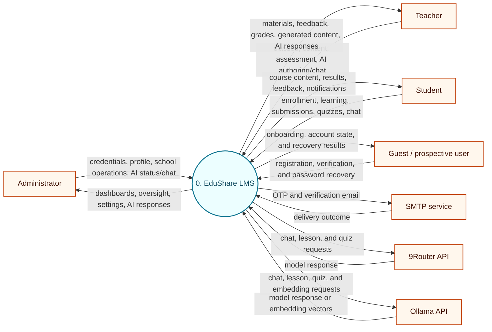
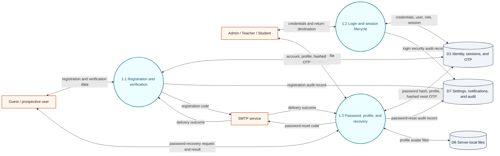
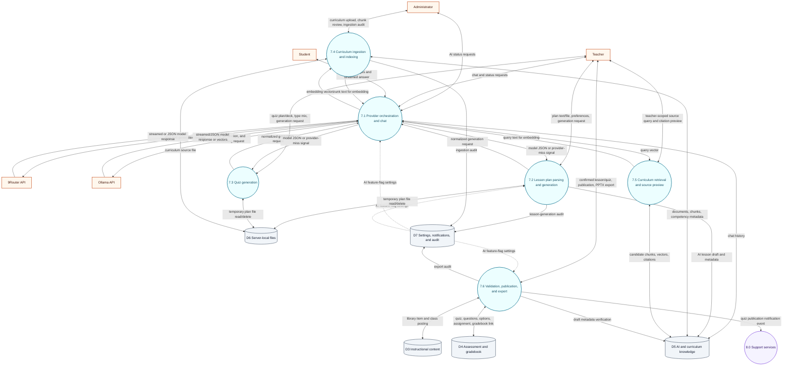
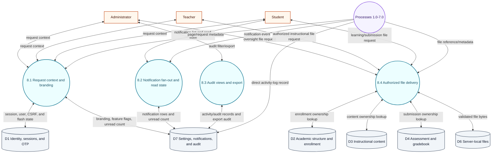

# EduShare 2.0 Data Flow Diagrams

## Document purpose

This document describes the **implemented** data flows of EduShare 2.0. It provides:

1. a Context DFD for the complete LMS;
2. a Level 1 DFD for the major runtime processes and logical data stores; and
3. focused Level 2 DFDs for identity, teaching-learning-grading, AI/curriculum, and cross-cutting support.

The diagrams are derived from the current source tree rather than from older product descriptions. In particular, grounded lesson and quiz generation uses the teacher's lesson plan as its content source; curriculum retrieval is a separate source-preview capability and is not injected into those generation prompts.

## Scope and notation

### System boundary

The EduShare system boundary includes:

- the Express request/response application;
- server-rendered EJS pages and JSON endpoints;
- authentication, authorization, validation, and business services;
- the MySQL database reached through `src/config/database.js`;
- the MySQL-backed session store;
- server-local files under `storage/uploads`; and
- AI provider selection, fallback, and curriculum embedding/retrieval logic.

The following are outside the boundary and therefore are not expanded into processes:

- browsers and operating systems;
- Express, Node.js, MySQL, and the local filesystem as infrastructure internals;
- network transport; and
- version control and deployment tooling.

Of the eight Level 1 processes, this document decomposes 1.0 (as 1.1–1.3), 3.0–6.0 (combined as 3.1–3.6), 7.0 (as 7.1–7.6), and 8.0 (as 8.1–8.4) into focused Level 2 diagrams; 2.0 Administration and oversight is retained as a single Level 1 process and is not expanded.

### External entities and systems

- **Administrator** — manages accounts, school settings, curriculum ingestion, AI feature/status controls, oversight, sessions, and reason-gated interventions.
- **Teacher** — manages owned classes, content, assignments, grading, advisory records, AI authoring, and the teacher-scoped curriculum source-preview endpoint.
- **Student** — joins classes, views learning content, submits work, takes quizzes, views results, uses AI chat, and manages notifications.
- **Guest / prospective user** — registers, verifies an email OTP, and requests or completes password recovery before holding an authenticated role.
- **9Router API** — optional OpenAI-compatible provider for generation and chat.
- **Ollama API** — alternate generation/chat provider and the provider used for curriculum embeddings.
- **SMTP service** — transports registration and password-reset email.

Ollama plays a dual role as an external system: it is a generation/chat provider, and it is also the mandatory provider for curriculum embeddings and retrieval queries, which never route through 9Router.

### Symbols

| Symbol | Meaning |
|---|---|
| Rounded shape | Process |
| Open rectangle | External entity or external system |
| Cylinder | Logical data store |
| Solid arrow | Data flow |
| Dotted arrow | Control, event, or optional flow |
| Two-headed arrow | Paired request/response or read/write flows represented as one logical exchange |

Mermaid diagrams use rounded process nodes, rectangular external nodes, and cylindrical store nodes for consistency with the legend. A two-headed arrow is drawn instead of two separate one-way arrows when both directions belong to a single logical exchange — a request and its response, or a process reading and updating the same record — so the reader sees one round trip rather than disconnected flows.

---

## Context DFD — Level 0

The Context DFD intentionally hides internal processes and data stores. MySQL and `storage/uploads` are internal to EduShare; only external users and external services are shown.

### Context flow summary

| External entity | Inputs to EduShare | Outputs from EduShare |
|---|---|---|
| Administrator | Credentials, user/profile operations, settings, oversight, intervention, session, curriculum-ingestion, AI status, and AI chat requests | Dashboard statistics, user and school settings, AI feature state, oversight views, exports, intervention outcomes, AI chat responses |
| Teacher | Credentials, class/enrollment, material, activity, grading, advisory, lesson, quiz, chat, and source-preview requests | Class rosters, learning content, submission feedback, gradebook results, generated lessons/quizzes, exports, source citations when the teacher-scoped endpoint is called, AI chat responses |
| Student | Credentials, join code, learning, submission, quiz, result, chat, notification, and file requests | Course pages, materials, submission status, quiz feedback, grades, AI responses, notifications, authorized files |
| Guest / prospective user | Registration data, verification codes, and password-recovery requests | Onboarding/account state, verification results, and recovery results |
| 9Router | Model responses for configured chat/generation requests | Chat, lesson, and quiz generation requests |
| Ollama | Model responses and embedding vectors | Chat/generation requests and curriculum embedding requests |
| SMTP | SMTP transaction outcome | OTP and password-reset messages |

---

## Level 1 DFD

```mermaid
flowchart TB
    A["Administrator"]
    T["Teacher"]
    S["Student"]
    G["Guest / prospective user"]
    NR["9Router API"]
    OL["Ollama API"]
    SMTP["SMTP service"]

    P1(("1.0 Identity and access"))
    P2(("2.0 Administration and oversight"))
    P3(("3.0 Classes and enrollment"))
    P4(("4.0 Instructional content"))
    P5(("5.0 Assessment and gradebook"))
    P6(("6.0 Student learning"))
    P7(("7.0 AI and curriculum"))
    P8(("8.0 Support services"))

    D1[("D1 Identity, sessions, and OTP")]
    D2[("D2 Academic structure and enrollment")]
    D3[("D3 Instructional content")]
    D4[("D4 Assessment and gradebook")]
    D5[("D5 AI and curriculum knowledge")]
    D6[("D6 Server-local files")]
    D7[("D7 Settings, notifications, and audit")]

    A <-->|"identity and profile"| P1
    T <-->|"identity and profile"| P1
    S <-->|"identity and profile"| P1
    G <-->|"registration, verification, and recovery"| P1

    A <-->|"administration, oversight, interventions"| P2
    A <-->|"curriculum ingestion and AI status/controls"| P7

    T <-->|"classes and enrollment administration"| P3
    T <-->|"materials, lessons, activities, announcements"| P4
    T <-->|"grading and gradebook administration"| P5
    T <-->|"AI authoring, chat, and source preview"| P7

    S <-->|"join and class participation"| P3
    S <-->|"materials, activities, submissions"| P4
    S <-->|"quiz attempts, results, and grades"| P5
    S <-->|"dashboard and course learning"| P6
    A <-->|"AI chat and status"| P7
    S <-->|"AI study chat"| P7
    S <-->|"notifications and authorized files"| P8

    A <-->|"authorized oversight files"| P8
    T <-->|"authorized instructional files"| P8

    P1 <-->|"accounts, profiles, sessions, OTPs"| D1
    P1 <-->|"account and security audit records"| D7
    P1 <-->|"profile avatar files"| D6
    P1 -->|"OTP and reset email"| SMTP
    SMTP -->|"delivery outcome"| P1

    P2 <-->|"user and profile records"| D1
    P2 <-->|"classes, enrollments, requests"| D2
    P2 <-->|"content oversight"| D3
    P2 <-->|"grade and attempt oversight"| D4
    P2 <-->|"curriculum and competency oversight"| D5
    P2 <-->|"school logo files"| D6
    P2 <-->|"settings, logo metadata, and audit records"| D7

    P3 <-->|"profile and role data"| D1
    P3 <-->|"classes, memberships, requests"| D2
    P3 <-->|"enrollment and advisory audit records"| D7
    P3 -->|"enrollment notification events"| P8

    P4 <-->|"materials, activities, announcements"| D3
    P4 <-->|"submission and attachment data"| D4
    P4 <-->|"uploaded and posted files"| D6
    P4 -->|"content notification events"| P8

    P5 <-->|"quizzes, attempts, submissions, grades"| D4
    P5 <-->|"attachment references"| D6
    P5 -->|"grade notification events"| P8

    P6 <-->|"enrollment and class context"| D2
    P6 <-->|"published learning content"| D3
    P6 <-->|"results and grade summaries"| D4
    P6 <-->|"branding and notification context"| P8

    P7 <-->|"generated and published lessons/quizzes"| D3
    P7 <-->|"published quizzes and assessment data"| D4
    P7 <-->|"AI drafts, chat, curriculum, vectors"| D5
    P7 <-->|"temporary plans and curriculum files"| D6
    P7 <-->|"AI flags and audit records"| D7
    P7 -->|"generation and chat requests"| NR
    NR -->|"model response"| P7
    P7 -->|"generation, chat, and embedding requests"| OL
    OL -->|"model response or vectors"| P7
    P7 -->|"quiz publication notification events"| P8

    P8 <-->|"session, user, and flash context"| D1
    P8 <-->|"search and enrollment ownership lookups"| D2
    P8 <-->|"search and content ownership lookups"| D3
    P8 <-->|"search and submission ownership lookups"| D4
    P8 <-->|"authorized file bytes"| D6
    P8 <-->|"notifications and unread counts"| D7

    classDef external fill:#fff7ed,stroke:#c2410c,color:#431407,stroke-width:1.5px
    classDef process fill:#ecfeff,stroke:#0e7490,color:#164e63,stroke-width:2px
    classDef store fill:#f1f5f9,stroke:#475569,color:#0f172a,stroke-width:1.5px
    class A,T,S,G,NR,OL,SMTP external
    class P1,P2,P3,P4,P5,P6,P7,P8 process
    class D1,D2,D3,D4,D5,D6,D7 store
```

### Level 1 process dictionary

| Process | Implemented responsibility | Principal implementation evidence |
|---|---|---|
| **1.0 Identity and access** | Public teacher/student OTP registration, account-state checks, login, logout, role redirects, password change/reset, profile update, session creation, and CSRF-backed form handling | `src/routes/authRoutes.js:44-82`; `src/controllers/authController.js:88-947`; `src/services/otpService.js:18-63`; `src/middleware/auth.js:1-46`; `src/middleware/csrf.js:3-68` |
| **2.0 Administration and oversight** | Dashboard statistics; user lifecycle; school and AI feature settings; read-only class, gradebook, quiz, activity, user, curriculum, and competency oversight; session oversight; logged/reason-gated interventions; exports | `src/routes/adminRoutes.js:9-68`; `src/controllers/adminController.js:9-715`; `src/controllers/adminOversightController.js:11-665`; `src/controllers/adminInterventionController.js:17-1459` |
| **3.0 Classes and enrollment** | Teacher class creation and rosters, student code-based joining, advisory approval, enrollment changes, transfer/change-request state, and enrollment notifications | `src/routes/teacherRoutes.js:11-14`; `src/routes/teacherRoutes.js:28-38`; `src/routes/studentRoutes.js:12-13`; `src/controllers/teacherController.js:91-1580`; `src/controllers/studentController.js:107-164`; `src/services/enrollmentService.js:33-113` |
| **4.0 Instructional content** | Material library, material posting, file-backed activities, announcements/read state, student class view, activity submission, and content notifications | `src/routes/teacherRoutes.js:15-17`; `src/routes/teacherRoutes.js:21-23`; `src/routes/studentRoutes.js:14-17`; `src/controllers/teacherController.js:177-713`; `src/controllers/studentController.js:165-353` |
| **5.0 Assessment and gradebook** | Assignment grading, quiz authoring/attempt grading, DepEd category computation, transmutation, teacher gradebook entries, student result views, and grade-linked notification refreshes | `src/routes/teacherRoutes.js:18-19`; `src/routes/teacherRoutes.js:25-26`; `src/routes/studentRoutes.js:19-21`; `src/routes/apiRoutes.js:13-98`; `src/controllers/teacherController.js:409-766`; `src/controllers/studentController.js:354-622`; `src/services/gradebookService.js:4-259`; `src/config/initDatabase.js:420-424` |
| **6.0 Student learning** | Student dashboard, enrolled-class list, and request-scoped learning context; class detail, deadlines, materials, announcements, submissions, and result views are composed by 3.0, 4.0, and 5.0 | `src/routes/studentRoutes.js:11-12`; `src/controllers/studentController.js:7-106`; `src/middleware/branding.js:65-119` |
| **7.0 AI and curriculum** | AI chat for authenticated users, provider health/fallback, plan parsing, lesson generation/validation/save/export, quiz generation/validation/save, curriculum file ingestion, chunking, embeddings, retrieval, and the teacher-scoped source-preview endpoint | `src/routes/aiRoutes.js:8-47`; `src/routes/curriculumRoutes.js:8-18`; `src/routes/studentRoutes.js:23-24`; `src/routes/teacherRoutes.js:39-40`; `src/controllers/aiController.js:36-931`; `src/controllers/curriculumController.js:39-220`; `src/controllers/teacherController.js:1582-1646`; `src/services/aiService.js:6-562`; `src/services/embeddingService.js:3-48`; `src/services/retrievalService.js:5-110` |
| **8.0 Support services** | Request branding/flash context, unread notification state, notification fan-out/read state, authenticated search, and ownership-checked file delivery | `src/middleware/branding.js:12-132`; `src/services/notificationService.js:24-202`; `src/routes/apiRoutes.js:9-12`; `src/routes/filesRoutes.js:10-144`; `src/routes/notificationRoutes.js:7-13`; `src/routes/studentRoutes.js:25-27` |

### Level 1 logical stores

Student `activity_submissions` live in D4 rather than D3 because a submission is assessment evidence — it carries the learner's file, attempt state, and score that feed feedback and the gradebook — whereas D3 holds the teacher-authored instructional content that students consume.

| Store | Contents | Primary implementation evidence |
|---|---|---|
| **D1** | `users`, `teachers`, `students`, `sessions`, `otp_verifications` | `src/config/schema.sql:6-53`; `src/config/schema.sql:448-468`; `src/config/sessionStore.js:7-140` |
| **D2** | `classes`, `enrollments`, `section_transfer_requests`, `student_change_requests` | `src/config/schema.sql:54-83`; `src/config/schema.sql:476-531` |
| **D3** | `library_items`, `class_materials`, `class_activities`, `activity_posts`, `announcements`, `announcement_reads` | `src/config/schema.sql:84-136`; `src/config/schema.sql:239-267` |
| **D4** | `activity_submissions`, quizzes and answer structures, attempts, gradebook categories/columns/entries, and the reserved `attendance` table (no current runtime flow) | `src/config/schema.sql:137-155`; `src/config/schema.sql:156-237`; `src/config/schema.sql:294-348` |
| **D5** | `ai_content`, `chat_history`, `curriculum_documents`, `document_chunks`, `competencies` | `src/config/schema.sql:370-447` |
| **D6** | Uploaded avatars, logos, materials, submissions, temporary plans, and curriculum source files under `storage/uploads`; the current authenticated file route exposes only the whitelisted persisted user-file directories | `src/middleware/upload.js:6-139`; `src/routes/filesRoutes.js:12-14` |
| **D7** | `activity_logs`, `system_settings`, `notifications` | `src/config/schema.sql:274-293`; `src/config/schema.sql:349-369` |

The `attendance` table stores per-class, per-day student attendance status with a `recorded_by` user reference, but no current route or controller reads or writes it, so it carries no DFD flow.

Activity-log writes are made directly by the identity, administration/oversight, advisory/enrollment, and AI/curriculum controllers. The support layer owns notification fan-out/read state and provides audit filtering/export over those records; it is not the sole audit writer.

---

## Focused Level 2 DFD — 1.0 Identity and access

This decomposition preserves the Context/L1 identity flows: a guest can register and recover a password, the three authenticated roles can log in and manage identity data, records are stored in D1, and OTP/reset messages cross the SMTP boundary.

| Subprocess | Responsibility |
|---|---|
| **1.1 Registration and verification** | Accept teacher/student identity data, mint and hash purpose-bound OTPs, create pending accounts on successful verification, and return onboarding/account state. |
| **1.2 Login and session lifecycle** | Validate credentials and account state, apply role-specific redirects, create the server session, enforce rate limits, record login activity, and support logout. |
| **1.3 Password, profile, and recovery** | Authenticate a signed-in password change, execute OTP-backed password reset, and update profile/avatar data. |

---

## Focused Level 2 DFD — 3.0–6.0 Teaching, learning, and grading

This focused decomposition expands the four Level 1 processes that together implement the teaching-learning-grading lifecycle. The `8.0 Support services` node shown here is a sibling process inside the same system boundary — drawn in a different shape to indicate a cross-cutting reference, not an external entity — and is expanded separately in its own Level 2 package.

```mermaid
flowchart TB
    T["Teacher"]
    S["Student"]
    SUP(("8.0 Support services"))

    P31(("3.1 Class and enrollment management"))
    P32(("3.2 Content and assignment authoring"))
    P33(("3.3 Learning and submission workflow"))
    P34(("3.4 Assessment and feedback"))
    P35(("3.5 Gradebook computation"))
    P36(("3.6 Student learning workspace"))

    D1[("D1 Identity, sessions, and OTP")]
    D2[("D2 Academic structure and enrollment")]
    D3[("D3 Instructional content")]
    D4[("D4 Assessment and gradebook")]
    D6[("D6 Server-local files")]
    D7[("D7 Settings, notifications, and audit")]

    T <-->|"class creation, rosters, advisory and transfer actions"| P31
    S <-->|"join code, enrollment state, class view"| P31
    T <-->|"materials, announcements, activities"| P32
    S <-->|"published content and activity work"| P33
    T <-->|"quiz publication, grading, manual scores"| P34
    S <-->|"quiz attempt and submission state"| P34
    T <-->|"gradebook views and exports"| P35
    S <-->|"grade summaries and results"| P35
    S <-->|"dashboard, deadlines, course workspace"| P36

    P31 <-->|"user role and profile"| D1
    P31 <-->|"classes, enrollments, requests"| D2
    P31 <-->|"enrollment and advisory audit records"| D7
    P32 <-->|"library, postings, activities, announcements"| D3
    P32 <-->|"material and activity files"| D6
    P33 <-->|"membership and class scope"| D2
    P33 <-->|"learning content and read state"| D3
    P33 <-->|"submissions, attempts, attachment refs"| D4
    P33 <-->|"submission and material files"| D6
    P34 <-->|"quizzes, attempts, answers, submissions, grades"| D4
    P34 <-->|"attachment references"| D6
    P35 <-->|"gradebook categories, columns, entries, results"| D4
    P36 <-->|"classes and enrollments"| D2
    P36 <-->|"published content"| D3
    P36 <-->|"results and grade summaries"| D4
    P36 <-->|"branding and notification context"| SUP

    P31 -->|"enrollment notification event"| SUP
    P32 -->|"content notification event"| SUP
    P34 -->|"grade notifications after quiz submission and activity grading"| SUP
    P35 -->|"grade notification after manual gradebook entry"| SUP

    classDef external fill:#fff7ed,stroke:#c2410c,color:#431407,stroke-width:1.5px
    classDef process fill:#ecfeff,stroke:#0e7490,color:#164e63,stroke-width:2px
    classDef store fill:#f1f5f9,stroke:#475569,color:#0f172a,stroke-width:1.5px
    classDef sibling fill:#f5f3ff,stroke:#6d28d9,color:#2e1065,stroke-width:1.5px
    class T,S external
    class P31,P32,P33,P34,P35,P36 process
    class D1,D2,D3,D4,D6,D7 store
    class SUP sibling
```

| Subprocess | Responsibility |
|---|---|
| **3.1 Class and enrollment management** | Generate/manage class codes, create classes, join by code, maintain active enrollment, approve students, and process transfer/change requests. |
| **3.2 Content and assignment authoring** | Maintain the teacher library, upload/repost materials, publish announcements, create file-backed activities, and control teacher ownership. |
| **3.3 Learning and submission workflow** | Present enrolled class content, enforce posting/ownership state, accept activity files, and track student submission state. |
| **3.4 Assessment and feedback** | Publish quizzes, record attempts and answers, auto-grade supported items, grade activity submissions, publish feedback, and update gradebook-linked scores. |
| **3.5 Gradebook computation** | Combine Written Works (20%), Performance Tasks (50%), and Quarterly Exams (30%), apply overrides and transmutation, and produce views/exports. |
| **3.6 Student learning workspace** | Assemble dashboard deadlines, class materials, activities, announcements, and result summaries from authorized records. |

---

## Focused Level 2 DFD — 7.0 AI and curriculum

The diagram deliberately separates **plan-based generation** from **curriculum ingestion/retrieval**. `7.2` and `7.3` do not read D5 for generation grounding; `7.4` and `7.5` provide curriculum indexing and the teacher-scoped source-preview endpoint independently. The `/ai/chat/*` routes require authentication but do not impose a role restriction, so each authenticated role is shown as a chat actor. The shipped curriculum page is admin-scoped and its client attempts the teacher-only preview endpoint; successful teacher source preview is therefore a route-level capability, not currently reachable from the shipped teacher UI, while the admin UI renders the blocked response as a notice.

| Subprocess | Responsibility |
|---|---|
| **7.1 Provider orchestration and chat** | Try 9Router first when configured, fall through to Ollama, signal a provider miss to generation callers, and stream/persist authenticated chat. |
| **7.2 Lesson plan parsing and generation** | Parse pasted or uploaded ILAW/DLL/DLP plans, rebuild teacher grid edits, build a closed-world plan-grounded prompt, generate/normalize slides, and save an AI draft. |
| **7.3 Quiz generation** | Ground questions in the teacher plan and optional generated deck, enforce the requested item mix and answer keys, validate traceability, and flag fallback/ungrounded output. |
| **7.4 Curriculum ingestion and indexing** | Accept admin text/PDF curriculum files, normalize and chunk them, request Ollama embeddings, and persist document/chunk metadata and vectors. |
| **7.5 Curriculum retrieval and source preview** | Expose the teacher-scoped source-preview endpoint, full-text prefilter stored chunks, rerank with an Ollama query embedding when possible, and return citations. |
| **7.6 Validation, publication, and export** | Reject unsafe or untraceable output unless the teacher explicitly confirms review, publish lessons/quizzes transactionally, link quizzes to gradebook columns, notify students for quiz publication, and generate PPTX output. |

### AI provider and grounding invariants

1. **Generation order:** 9Router → Ollama → in-process offline fallback. `AI_PRIMARY=ollama` changes the first preference, but an unusable first provider still falls through.
2. **Embedding path:** curriculum embeddings and retrieval queries always call Ollama `/api/embed`; they never go through 9Router.
3. **Lesson source of truth:** the teacher's ILAW/DLL/DLP plan. Current code explicitly excludes CG/BOW retrieval from lesson prompts.
4. **Quiz source of truth:** the teacher plan first and generated lesson deck second. Curriculum chunks are not inserted into the current quiz prompt.
5. **Feature gates:** `school.flags.allow_ai_lesson` and `allow_ai_quiz` are loaded by branding middleware into `res.locals` and enforced in `7.1` (chat), `7.2` (lesson generation), and `7.6` (quiz/PPTX export), so D7 supplies flag context to each of them.
6. **Fallback transparency:** generated fallback content is marked and requires explicit teacher confirmation before publication.
7. **Temporary plan handling:** uploaded plan files are parsed and removed after generation; they are not persistent library content.

---

## Focused Level 2 DFD — 8.0 Support services

| Subprocess | Responsibility |
|---|---|
| **8.1 Request context and branding** | Ensure a CSRF token, expose school identity/year/term/feature flags, user and path context, unread count, and single-use flash values. |
| **8.2 Notification fan-out and read state** | Fan events out to active students, deduplicate/refresh matching notifications, and support list, unread count, and read-all/read-one operations. |
| **8.3 Audit views and export** | Read and filter the activity-log records written directly by the business and administration processes, then support administrator export. |
| **8.4 Authorized file delivery** | Validate the filename and directory whitelist, then authorize admins, any authenticated user for avatars/logos, owning teachers, assigned teachers, enrolled students, or submission owners before sending a file. |

---

## Balancing and coverage checks

### Context to Level 1

| Context flow | Level 1 destination(s) |
|---|---|
| Administrator credentials/profile/operations | 1.0 and 2.0 |
| Teacher credentials/classes/content/assessment/AI | 1.0, 3.0, 4.0, 5.0, and 7.0 |
| Student credentials/enrollment/learning/submission/quiz/chat | 1.0, 3.0, 4.0, 5.0, 6.0, and 7.0 |
| Guest registration/verification/password recovery | 1.0 |
| Administrator dashboards/oversight/settings/AI status/chat/results | 2.0, 7.0, and 8.0 |
| Teacher materials/feedback/grades/generated content/chat | 3.0, 4.0, 5.0, 7.0, and 8.0 |
| Student content/results/feedback/notifications | 4.0, 5.0, 6.0, 7.0, and 8.0 |
| SMTP email and outcome | 1.0 |
| 9Router requests/responses | 7.0 |
| Ollama generation/chat/embedding requests and responses | 7.0 |

Internal D1–D7 flows appear only after the Context process is decomposed, as required by DFD convention.

### Level 1 to focused Level 2

| Level 1 process | Focused Level 2 treatment |
|---|---|
| 1.0 Identity and access | Expanded as 1.1–1.3 |
| 2.0 Administration and oversight | Retained as a Level 1 process; intervention and oversight details are traced in the process dictionary rather than expanded in this focused package |
| 3.0 Classes and enrollment | Combined with 4.0, 5.0, and 6.0 as 3.1–3.6 |
| 4.0 Instructional content | Combined with 3.0, 5.0, and 6.0 as 3.1–3.6 |
| 5.0 Assessment and gradebook | Combined with 3.0, 4.0, and 6.0 as 3.1–3.6 |
| 6.0 Student learning | Combined with 3.0, 4.0, and 5.0 as 3.1–3.6 |
| 7.0 AI and curriculum | Expanded as 7.1–7.6 |
| 8.0 Support services | Expanded as 8.1–8.4 |

### Data-store coverage

| Store | Level 1 processes | Focused Level 2 evidence |
|---|---|---|
| D1 | 1.0, 2.0, 3.0, 8.0 | Identity 1.1–1.3; TLG 3.1; support 8.1 |
| D2 | 2.0, 3.0, 6.0, 8.0 | TLG 3.1, 3.3, 3.6; support 8.4 |
| D3 | 2.0, 4.0, 6.0, 7.0, 8.0 | TLG 3.2, 3.3, 3.6; AI 7.6; support 8.4 |
| D4 | 2.0, 4.0, 5.0, 6.0, 7.0, 8.0 | TLG 3.3–3.6; AI 7.6; support 8.4 |
| D5 | 2.0, 7.0 | Administration curriculum/competency oversight; AI 7.1, 7.2, 7.4, 7.5, 7.6 |
| D6 | 1.0, 2.0, 4.0, 5.0, 7.0, 8.0 | Identity 1.3; TLG 3.2–3.4; AI 7.2–7.4; support 8.4 |
| D7 | 1.0, 2.0, 3.0, 7.0, 8.0 | Identity 1.1–1.3; TLG 3.1; AI 7.1, 7.2, 7.4, 7.6; support 8.1–8.3 |

The first column lists only processes with a direct D7 edge. Notification traffic from 3.0, 4.0, 5.0, and 7.0 reaches D7 indirectly through 8.0, so it is drawn as a process-to-process event flow at Level 1 and as a `SUP`-directed event in the focused packages.

---

## Security and control flows

The DFD intentionally does not duplicate every middleware as a process. The following implemented controls qualify the depicted flows:

- session cookies are signed, HTTP-only, same-site, and secure in production;
- `requireRole('admin' | 'teacher' | 'student')` gates role modules;
- state-changing form and JSON routes validate a session-bound CSRF token; multipart routes validate after Multer parses the body; the current `POST /auth/logout` route is an explicit code-level exception;
- passwords and OTPs are bcrypt-hashed;
- login and OTP endpoints use request rate limits;
- Helmet and explicit Content Security Policy/CORS settings protect HTTP responses;
- controller queries repeatedly enforce teacher ownership, student enrollment, and role scope;
- file delivery validates the subdirectory, generated filename format, and record-based ownership for materials/submissions before reading local bytes; avatars and logos are available to any authenticated user;
- administrative interventions require reasons and write audit records; and
- transactions protect multi-row AI lesson and quiz publication operations.

Primary evidence: `src/app.js:31-173`, `src/middleware/auth.js:1-46`, `src/middleware/csrf.js:3-68`, `src/routes/filesRoutes.js:23-142`, and `src/controllers/adminInterventionController.js:17-1459`.

---

## Runtime and architectural notes

1. **Database startup:** `server.js` invokes `initDatabase()` before listening. Startup creates the database/schema, applies gated migrations, backfills enrollment, seeds settings, and seeds missing demo records. This operational activity is not a request-level DFD process.
2. **Persistence boundary:** application queries use `query()` or `withTransaction()` from `src/config/database.js`; the raw MySQL pool is an infrastructure detail, not an external entity in these diagrams.
3. **Session storage:** sessions are held in the `sessions` table through a custom MySQL store and are logically part of D1.
4. **File storage:** user uploads are stored outside `public/` under `storage/uploads`; authenticated download routes serve the persisted files.
5. **Static assets:** CSS, JavaScript, and images under `public/` are browser presentation assets and are not modeled as business data stores.
6. **Search:** authenticated cross-content search is a Level 1 support function; its results are read-only aggregates across existing stores.
7. **Documentation accuracy:** where older prose conflicts with current source, the source path and line references in this document control.

---

## Source traceability index

| Concern | Current source |
|---|---|
| Application composition, security, sessions, and route mounts | `src/app.js:26-182` |
| Database pool and transaction boundary | `src/config/database.js:6-60` |
| Startup initialization | `server.js:13-35`; `src/config/initDatabase.js:7` |
| Canonical schema | `src/config/schema.sql:6-531` |
| MySQL session store | `src/config/sessionStore.js:7-140` |
| Authentication and role gates | `src/middleware/auth.js:1-46` |
| CSRF handling | `src/middleware/csrf.js:3-68` |
| Branding, flash, feature flags, unread count | `src/middleware/branding.js:12-132` |
| Authentication routes | `src/routes/authRoutes.js:44-82` |
| Administrator routes | `src/routes/adminRoutes.js:9-68` |
| Teacher routes | `src/routes/teacherRoutes.js:8-40` |
| Student routes | `src/routes/studentRoutes.js:8-27` |
| AI routes | `src/routes/aiRoutes.js:8-47` |
| Curriculum routes | `src/routes/curriculumRoutes.js:8-18` |
| File storage and validation | `src/middleware/upload.js:6-139` |
| Authorized file delivery | `src/routes/filesRoutes.js:10-144` |
| Identity/registration/password flows | `src/controllers/authController.js:88-947`; `src/services/otpService.js:18-63` |
| Administration and oversight | `src/controllers/adminController.js:9-715`; `src/controllers/adminOversightController.js:11-665` |
| Administrative interventions | `src/controllers/adminInterventionController.js:17-1459` |
| Teacher class/content/assessment/advisory flows | `src/controllers/teacherController.js:91-1580` |
| Student learning/submission/quiz/chat flows | `src/controllers/studentController.js:7-684` |
| AI chat, lesson, quiz, save, and export flows | `src/controllers/aiController.js:36-931` |
| Plan/lesson/quiz grounding contracts | `src/services/groundingService.js:40-298` |
| AI provider selection and fallback | `src/services/aiService.js:6-562` |
| Curriculum ingestion and teacher-scoped source preview | `src/controllers/curriculumController.js:39-220`; `src/services/chunkingService.js:4-42`; `public/js/curriculum-upload.js:71`; `src/views/admin/curriculum.ejs:124` |
| Curriculum embeddings and retrieval | `src/services/embeddingService.js:3-48`; `src/services/retrievalService.js:5-110` |
| Gradebook computation | `src/services/gradebookService.js:4-259`; DepEd category weights (Written Works 20 / Performance Tasks 50 / Quarterly Exam 30) seeded in `src/config/initDatabase.js:420-424` |
| Notification fan-out/read state | `src/services/notificationService.js:24-202` |

## Maintenance rule

When routes, controllers, schema, or services change:

1. update the affected Level 1 process/store mapping;
2. update the relevant focused Level 2 diagram;
3. re-run Context-to-Level-1 and Level-1-to-Level-2 balancing checks;
4. confirm that new external integrations appear in the Context DFD; and
5. update the source traceability index so the DFD remains implementation-auditable.
