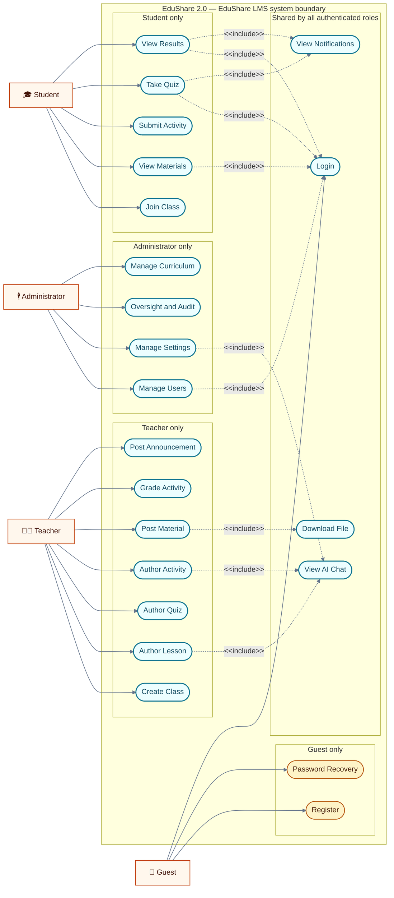
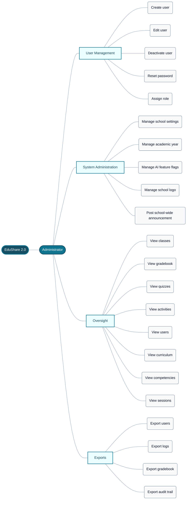
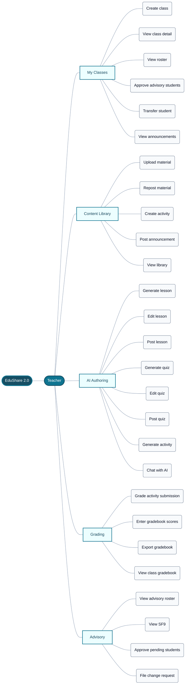
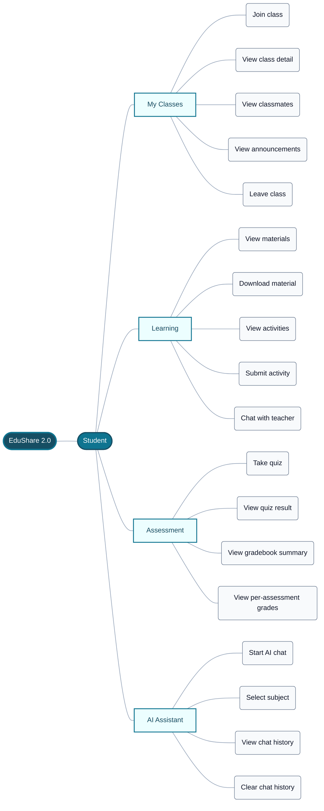

# EduShare 2.0 Complementary Modelling Diagrams

## Document purpose

This document describes the implemented use case diagram and functional decomposition diagrams of EduShare 2.0. It complements the DFD document (`edushare-dfd.md`): the DFDs describe data movement between processes, data stores, and external entities, while the diagrams in this document describe the actor-to-use-case relationships of the whole system (use case diagram) and the hierarchical breakdown of the system's functions per user role (functional decomposition diagrams).

The diagrams are derived from the current source tree and follow the same implementation-auditable conventions as the DFD document: every use case reflects a real route or controller, and every function listed in a functional decomposition diagram is backed by shipped code.

## Scope and notation

The system boundary, external entities, and logical data stores are defined in `edushare-dfd.md` and are not repeated here. Diagram symbols follow the conventions described in the subsections below.

### Symbols

| Symbol | Meaning |
|---|---|
| Actor node (emoji figure) | Human actor outside the system boundary |
| Stadium shape inside the boundary | Use case |
| Solid line | Association between an actor and a use case |
| Dashed line labelled `<<include>>` | Included behaviour that a use case always invokes |
| Nested box inside the boundary | Use case group (shared, or owned by one role) |

The use case diagram uses a single enclosing box for the EduShare 2.0 system boundary. Every use case is drawn as a stadium shape inside that boundary, grouped by whether it is shared, Guest-only, or owned by one of the three authenticated roles. Actor-to-use-case associations are plain solid lines, because the association itself carries no label; the labelled dashed arrows are reserved for `<<include>>` relationships, which are the only relationships in this document that state a behavioural dependency.

The functional decomposition diagrams use a different visual grammar because they encode hierarchy, not interaction. There are no arrows between nodes at all: a function is drawn as a child of its module, a module as a child of its role, and the role as a child of the system. Containment is expressed by nesting and by a distinct node style per level, so a reader can identify a function's depth at a glance without following a labelled edge.

Each FDD is a single connected tree whose four levels are drawn as four left-to-right columns, so that a reader can scan one level at a time. The tree grows to the right rather than downward for a legibility reason that is measurable rather than stylistic: the third level of these diagrams holds eighteen to twenty-six functions, and a top-down layout must place every one of them side by side on a single rank. That produces a figure roughly 4,200 pixels wide, which forces Mermaid to scale the whole figure down to about a fifth of its natural size when it is embedded in a page, leaving body text at roughly two pixels. Rotating the same tree ninety degrees keeps the four levels and the parent-child containment exactly as they are, while letting each module stack its own functions vertically, which brings the figure back to roughly 800 pixels wide and full-size text. The levels are columns rather than rows; nothing else about the structure changes.

### Level conventions

A functional decomposition diagram in this document has exactly four levels, drawn as four columns from left to right:

| Level | Node | Count per diagram |
|---|---|---|
| 1 | System name | 1 |
| 2 | Role | 1 |
| 3 | Module | 4–5 |
| 4 | Function | 18–26 |

The Guest role is not decomposed, because its entire functional surface is already contained inside the Administrator's User Management module (Register, Login, Password Recovery). Decomposing it separately would duplicate those three functions without adding information.

### Figure and heading convention

Captions use the form `*Figure N. [Caption].*` and are numbered in document order. This document continues the figure sequence of the DFD document, so the use case diagram is Figure 9 and the three functional decomposition diagrams are Figures 10, 11, and 12. This document does not restate or renumber any diagram from `edushare-dfd.md`; the two documents share one continuous figure sequence and are read together.

---

## Use Case Diagram

The use case diagram presents the actor-to-use-case relationships of EduShare 2.0. Four primary actors interact with the system — Administrator, Teacher, Student, and Guest — and shared use cases such as Login, AI Chat, and File Download are reached by multiple actors via `<<include>>` relationships. The system boundary encloses all use cases and is labelled with the system name.

*Figure 9. Use Case Diagram.*

Figure 9 shows four actors and twenty-two use cases inside a single system boundary. The **Administrator** is the platform operator: it manages accounts, school settings, AI feature flags and the school logo, ingests curriculum documents, and performs read-only oversight of classes, gradebooks, quizzes, activities, users, competencies, and active sessions, together with the audit and export functions that follow from that oversight. The **Teacher** owns the instructional side of the system: it creates classes, maintains the material library, creates and grades activities, posts announcements, and drives the three AI authoring flows for lessons, quizzes, and activities. The **Student** consumes what those two roles produce: it joins a class with a join code, reads posted materials, submits activity work, sits quizzes inside their attempt window, and reviews the resulting scores. The **Guest** is the only unauthenticated actor, and its entire surface is the two-step OTP registration flow plus email-backed password recovery.

Four use cases are shared rather than owned. **Login** is included by every authenticated use case, because none of them is reachable without an established session. **View AI Chat** is included by the AI authoring use cases and by the Administrator's settings use case, because the school-level AI feature flags that Manage Settings writes are the same flags that decide whether the chat and the generators respond. **Download File** is included by the material, submission, and oversight use cases, all of which return a stored file that can only be read through the authenticated file route after a subdirectory, filename, and record-ownership check. **View Notifications** is included by the Student learning and assessment use cases, because each of those events — enrollment, a new material, a posted announcement, a published quiz, and a new grade — is what produces a notification.

Only representative include arrows are drawn to keep the diagram legible; the full fan-in is documented in the implementation notes. Ten dashed arrows stand in for a much larger set: four converge on Login, three on View AI Chat, one on Download File, and two on View Notifications. The sample spans all three authenticated roles, with two arrows originating from Administrator use cases, three from Teacher use cases, and five from Student use cases, so no role is absent from the shared group. Within that sample, Login and View AI Chat each receive arrows from more than one role, while Download File is drawn with a single Teacher source and View Notifications with Student sources; the remaining role reaches into those two are recorded in the implementation notes rather than drawn. Drawing the complete fan-in would bury the nineteen actor associations under a mesh of converging dashed lines, so the arrows shown are chosen to keep every role and every shared use case visible in the same figure.

The remaining fourteen use cases are role-specific. Register and Password Recovery belong to the Guest alone, since both run before a role exists. Manage Users, Manage Settings, Oversight and Audit, and Manage Curriculum are Administrator-only and are gated by `requireRole('admin')`. Create Class, Author Lesson, Author Quiz, Author Activity, Post Material, Grade Activity, and Post Announcement are Teacher-only and are gated by `requireRole('teacher')`. Join Class, View Materials, Submit Activity, Take Quiz, and View Results are Student-only and are gated by `requireRole('student')`. The one deliberate relaxation of that pattern is AI Chat: the `/ai/chat` routes require authentication but impose no role restriction, so an Administrator and a Teacher reach the same chat behaviour as a Student.

---

## Functional Decomposition Diagrams

The functional decomposition diagrams in this section present a hierarchical breakdown of EduShare 2.0's functions per user role. Three separate diagrams are provided — one for each authenticated role: Administrator, Teacher, and Student. The Guest role is not decomposed separately because its only functions (Register, Login, Password Recovery) are already covered under the User Management module shown in the Administrator FDD.

Each FDD uses a single tree: the system name at the root, the role at the first level, the modules at the second level, and the individual functions at the third level. No arrows are drawn between nodes, because FDDs represent hierarchical containment rather than data flow. The four levels are drawn as four columns from left to right rather than as four rows from top to bottom, so that the eighteen to twenty-six functions on the last level remain legible at page width; see the notation section above for the measured reason.

### Functional Decomposition Diagram — Administrator

*Figure 10. Functional Decomposition Diagram (Administrator).*

The Administrator is the only actor whose decomposition is dominated by governance rather than by content. **User Management** is the account lifecycle: creating a teacher or student account with its role profile, editing an existing user's identity, deactivating and reactivating an account, issuing an administrative password reset, and assigning the role at account creation. Every one of these actions writes an activity-log record, and the deactivation and reset paths are reachable only from the Administrator's own user pages, so no teacher or student can disable an account. This module is also where the Guest's functions live in functional terms: registration and password recovery are the same identity pipeline that produces the accounts this module administers, which is why the Guest needs no separate decomposition.

**System Administration** and **Oversight** are deliberately asymmetric. The first group is the Administrator's write surface into `system_settings` — school identity and motto, the active school year, the AI feature flags that gate chat and the generators, the uploaded logo, and a school-wide announcement — and it is a single settings page whose values are read back into `res.locals` on every request by the branding middleware. The second group is read-only: classes, the E-Class Record gradebook, individual quizzes and activities, user records, the ingested curriculum corpus and its chunk list, the seeded DepEd competencies, and the live session table. Keeping oversight separate from administration in the diagram makes the audit property visible — the read-only group writes nothing, so an oversight click can never mutate a grade or a post.

**Exports** is the third group, and it is the point at which the Administrator's oversight work leaves the application. Two distinct CSV artifacts are produced: a filtered activity-log export of the audit trail, and a per-class gradebook export. Both are CSRF-protected POST routes rather than GET links precisely because each export writes its own audit entry, so the download itself is an accountable act.

### Functional Decomposition Diagram — Teacher

*Figure 11. Functional Decomposition Diagram (Teacher).*

The Teacher is the system's content-producing actor, and its decomposition separates classroom administration from content authorship from assessment. **My Classes** covers the structural work: creating a class and its join code, opening a class detail page, reading the roster, approving the students who register under the teacher's advisory, requesting a section transfer, and reviewing the announcements posted to the class. **Advisory** is the separate module because it operates on a different population — the teacher's advisees rather than the students enrolled in one subject section — and therefore a different authorization scope. It holds the advisory roster, the per-student record view, approval of pending advisees, and the change-request workflow that corrects a student's grade level or section.

**Content Library** is the teacher's reusable asset store. A material is uploaded once into the library and then reposted into any number of class sections, which is why upload and repost are separate functions; the same module also holds activity creation with a file attachment and class announcement posting. **AI Authoring** is the module that carries EduShare's differentiator, and it follows one repeated three-step shape — generate, edit, post — for lessons and for quizzes, plus a chat function for ad-hoc assistance. Generation is grounded in the teacher's own uploaded or pasted ILAW/DLL/DLP plan rather than in the system, the teacher reviews and edits the draft in the grid before anything is published, and only the post step writes a library item or a published quiz. Activity generation uses the same plan-grounded generation service.

**Grading** closes the loop the other three modules open. It grades activity submissions with written feedback, accepts manual gradebook cell entries for the DepEd-weighted categories, exposes the per-class gradebook view, and exports it as CSV. Because the gradebook is computed from Written Works 20 / Performance Tasks 50 / Quarterly Exams 30, every entry made here propagates to the transmuted grade the student sees.

### Functional Decomposition Diagram — Student

*Figure 12. Functional Decomposition Diagram (Student).*

The Student's decomposition is the mirror image of the Teacher's, and that symmetry is the point of the diagram: every module here is the read or write counterpart of a teacher module. **My Classes** answers "where am I enrolled" — joining a section with a 6-character code, opening the class workspace, seeing the cohort, and reading the announcements the teacher posted. **Learning** covers the posted-material tab and its file downloads, the activity list with due dates, and the submission action that attaches a file or a note and can be repeated until the teacher grades it.

**Assessment** is the counterpart of the Teacher's Grading module. A published quiz with an open attempt window is taken inside its time limit, submitted, auto-graded for the supported item types, and then reviewed on the result page. The gradebook summary and the per-assessment grade views are the student's read-only window onto the same DepEd-weighted record the teacher maintains, so the Student never writes a score. **AI Assistant** is the one module with no teacher counterpart: it is a study tutor scoped per subject, where the student picks a subject, starts or continues a conversation, reviews the stored history, and can clear either the current subject's history or the whole thread. It is drawn under the Student role because the student portal is where it is entered, even though the underlying chat route accepts any authenticated role.

---

## Implementation notes and declared scope

The DFD document distinguishes between a behaviour the code implements and a grouping drawn only to keep a module visible. The same distinction is recorded here, so that this document remains auditable against the source tree rather than merely plausible. Every function in Figures 10, 11, and 12 that is backed by a route is listed in the traceability index below; the functions that are **not yet route-backed** are named explicitly here.

| Function | Diagram | Status and evidence |
|---|---|---|
| Register, Password Recovery | Figure 9 (Guest-only) | Implemented — `src/routes/authRoutes.js:55-82` |
| Login (all roles) | Figure 9 (shared) | Implemented — `src/routes/authRoutes.js:44-45`; role redirect at `src/controllers/authController.js:43-47` |
| View AI Chat | Figure 9 (shared) | Implemented and role-agnostic — `src/routes/aiRoutes.js:10-13` applies `isAuthenticated` without `requireRole` |
| Download File | Figure 9 (shared) | Implemented — `src/routes/filesRoutes.js:10-144`, with subdirectory whitelist and record-based ownership checks |
| View Notifications | Figure 9 (shared) | **Student-scoped in code.** `src/routes/notificationRoutes.js:8` applies `requireRole('student')`, and the unread badge at `src/middleware/branding.js:79` is computed only for students. Drawn in the shared group as a modelling generalization: an Administrator or Teacher reaches the same underlying announcement, material, activity, quiz, and grade events through class oversight rather than through a personal inbox. |
| Post school-wide announcement | Figure 10, System Administration | **Not route-backed.** The Administrator can read announcements and hide or restore them (`src/routes/adminRoutes.js:53-54`), but announcement creation is teacher-only (`src/routes/teacherRoutes.js:15`). Drawn because the school-wide broadcast is in the module's stated scope. |
| Assign role | Figure 10, User Management | Partially route-backed. Role is set at account creation (`src/controllers/adminController.js:180-190`, `:1013-1019`) and the user list is role-filterable (`:57`, `:98`), but no post-creation role-change action exists. |
| Export users | Figure 10, Exports | **Not route-backed.** The shipped CSV artifacts are the filtered activity-log export (`src/routes/adminRoutes.js:68` → `src/controllers/adminInterventionController.js:1147-1148`) and the per-class gradebook export (`src/routes/adminRoutes.js:31` → `src/controllers/adminOversightController.js:439-441`). No user-list export route exists. |
| Export logs / Export audit trail | Figure 10, Exports | Both resolve to the same `/admin/logs/export` route over `activity_logs`; they are drawn as two functions because the guide treats the filtered view and the exported artifact as separate capabilities. |
| Generate activity | Figure 11, AI Authoring | Consistent with the DFD note on the activity generator: no dedicated activity-generation route exists. The same plan-grounded generation and validation service produces the activity content, which is then created through the class activity and library endpoints (`src/routes/teacherRoutes.js:17`, `:23`). |
| View SF9 | Figure 11, Advisory | **Not route-backed.** Advisory is a single roster-and-actions page (`src/routes/teacherRoutes.js:28-38`); no SF9 view exists anywhere in the source tree. |
| Chat with teacher | Figure 12, Learning | **Not route-backed.** There is no teacher-messaging feature. The only chat capability is the AI study assistant (`src/routes/aiRoutes.js:10-13`), which is drawn under AI Assistant. |
| View classmates | Figure 12, My Classes | **Not route-backed.** The student class workspace exposes four tabs — materials, activities, quizzes, and announcements (`src/controllers/studentController.js:238`) — and no peer list. |
| Leave class | Figure 12, My Classes | **Not route-backed.** No student-side withdraw route exists. Dropping and restoring an enrollment are Administrator interventions (`src/routes/adminRoutes.js:43-44`) and teacher advisory actions (`src/routes/teacherRoutes.js:32-33`). |
| View gradebook summary / View per-assessment grades | Figure 12, Assessment | Surfaced rather than standalone. There is no student gradebook page; scores reach the student through the class quizzes tab (`src/controllers/studentController.js:210-219`) and the quiz result page (`:577`). |

Two further modelling points are worth stating explicitly. First, the `<<include>>` fan-in in Figure 9 is sampled rather than complete: ten dashed arrows are drawn in place of the full set, spread across all three authenticated roles, so each shared use case shows fewer incoming arrows than it has in the implemented system. The authoritative relationships are the ones asserted in the narrative above — Login is included by every authenticated use case; View AI Chat is included by the three AI authoring use cases and by Manage Settings; Download File is included by Post Material, View Materials, Submit Activity, Oversight and Audit, and View Results; and View Notifications is included by Join Class, View Materials, Take Quiz, and View Results. Of those four, Login and View AI Chat are drawn with arrows from more than one role; Download File is drawn with a single Teacher source, so its Administrator source (Oversight and Audit) and its Student sources (View Materials, Submit Activity) are recorded here but not drawn; and View Notifications is drawn with Student sources, which is also its complete set, because every use case that includes it is student-owned. Second, **Assign role**, **Manage academic year**, **Manage AI feature flags**, and **Manage school logo** are four named functions in Figure 10 that all resolve to the single Administrator settings POST handler (`src/controllers/adminController.js:544-618`); they are decomposed separately because they carry different audit and ownership meanings to the school, not because they are separate requests.

## Source traceability index

| Concern | Diagram | Current source |
|---|---|---|
| Route mounting, role gates, and middleware order | Figures 9–12 | `src/app.js:26-182`; `src/middleware/auth.js:1-46`; `src/middleware/csrf.js:3-68` |
| Guest registration, recovery, and login | Figure 9 | `src/routes/authRoutes.js:44-82`; `src/controllers/authController.js:88-947`; `src/services/otpService.js:18-63` |
| Administrator user lifecycle | Figure 10 | `src/routes/adminRoutes.js:13-18`, `:60-62`; `src/controllers/adminController.js:55-525`; `src/controllers/adminInterventionController.js:881-1030` |
| Administrator settings, academic year, AI flags, logo | Figure 10 | `src/routes/adminRoutes.js:20-21`; `src/controllers/adminController.js:526-618`; `src/middleware/branding.js:12-63` |
| Administrator oversight and sessions | Figure 10 | `src/routes/adminRoutes.js:24-34`, `:56-58`; `src/controllers/adminOversightController.js:11-665`; `src/controllers/adminInterventionController.js:743-1000` |
| Administrator exports | Figure 10 | `src/routes/adminRoutes.js:31`, `:68`; `src/controllers/adminOversightController.js:431-441`; `src/controllers/adminInterventionController.js:1117-1148`; `src/services/exportService.js:1-49` |
| Curriculum ingestion and competencies oversight | Figure 9, Figure 10 | `src/routes/curriculumRoutes.js:10-17`; `src/controllers/curriculumController.js:39-206`; `src/controllers/adminController.js:620-634` |
| Teacher classes, rosters, and announcements | Figure 11 | `src/routes/teacherRoutes.js:11-15`; `src/controllers/teacherController.js:91-310` |
| Teacher content library and activities | Figure 11 | `src/routes/teacherRoutes.js:17`, `:21-23`; `src/controllers/teacherController.js:314-408`, `:563-712` |
| Teacher advisory, transfers, and change requests | Figure 11 | `src/routes/teacherRoutes.js:28-38`; `src/controllers/teacherController.js:767-1580` |
| Teacher AI lesson and quiz authoring | Figure 11 | `src/routes/aiRoutes.js:16-47`; `src/controllers/aiController.js:36-931`; `src/services/groundingService.js:40-298`; `src/services/aiService.js:6-562` |
| Teacher grading and gradebook | Figure 11 | `src/routes/teacherRoutes.js:18-19`, `:25-26`; `src/routes/apiRoutes.js:14-98`; `src/controllers/teacherController.js:409-765`; `src/services/gradebookService.js:4-259` |
| Student enrollment and class workspace | Figure 12 | `src/routes/studentRoutes.js:12-14`; `src/controllers/studentController.js:82-244` |
| Student activity submission | Figure 12 | `src/routes/studentRoutes.js:16-17`; `src/controllers/studentController.js:246-352` |
| Student quiz attempt and result | Figure 12 | `src/routes/studentRoutes.js:19-21`; `src/controllers/studentController.js:354-621` |
| Student AI assistant, subject scope, and history | Figure 12 | `src/routes/studentRoutes.js:23`; `src/routes/aiRoutes.js:10-13`; `src/controllers/studentController.js:623-639`; `src/controllers/aiController.js:36-140`; `src/views/student/chatbot.ejs:17-19`, `:105-114` |
| Notifications and unread state | Figure 9 (shared) | `src/routes/notificationRoutes.js:7-13`; `src/routes/studentRoutes.js:25-27`; `src/services/notificationService.js:24-202`; `src/middleware/branding.js:74-86` |
| Authorized file delivery | Figure 9 (shared) | `src/routes/filesRoutes.js:10-144`; `src/middleware/upload.js:6-139` |

## Maintenance rule

When routes, controllers, or role gates change:

1. update the affected use case in Figure 9 and its `<<include>>` arrows;
2. update only the FDD whose role owns the changed route;
3. move a function between the diagram and the Implementation notes table if it gains or loses a route — do not leave a planned function drawn as if it were implemented;
4. re-check that Figure 9's actor count still matches the roles gated in `src/middleware/auth.js`; and
5. update the Source traceability index so the figures stay auditable against the source tree.
